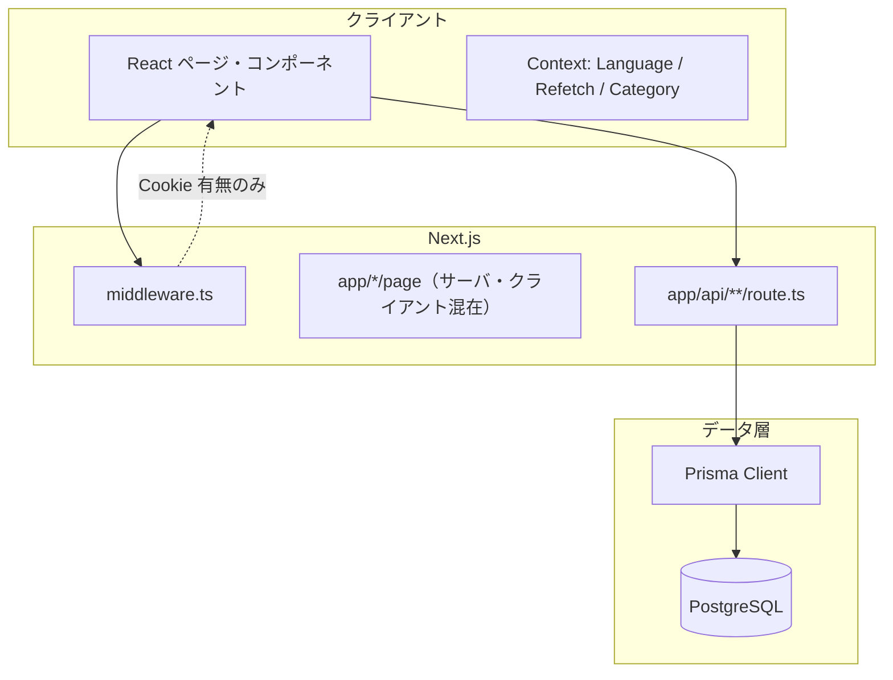
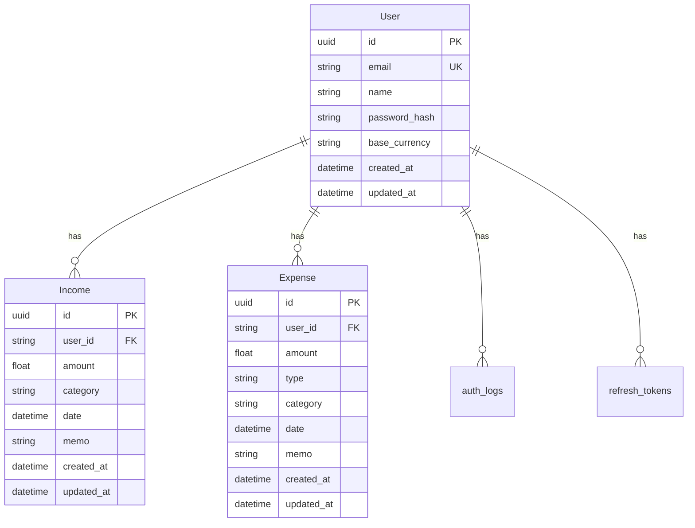
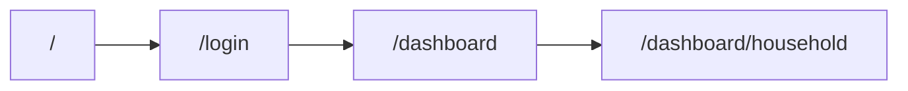
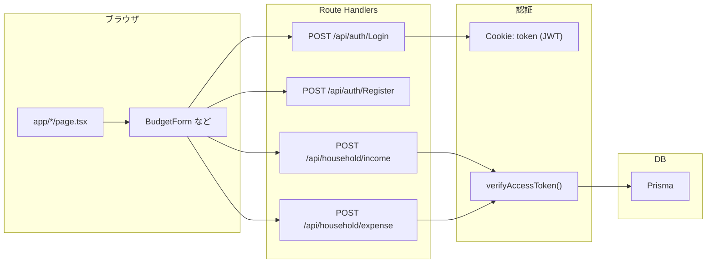
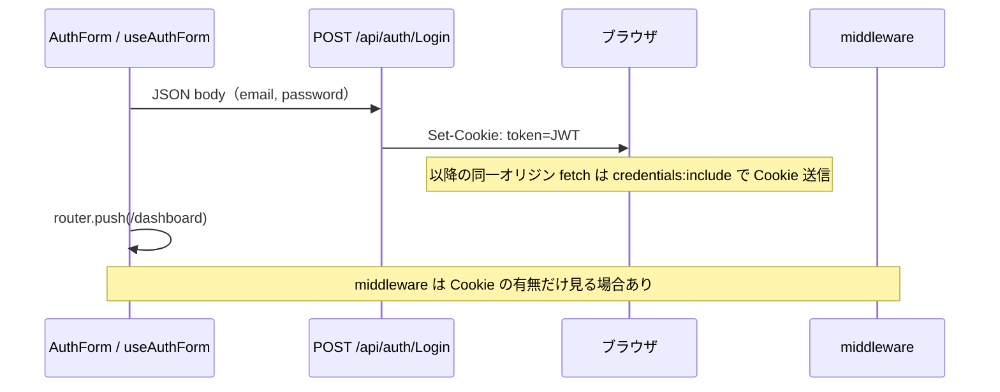

# Mirai（daichi-investment）システム設計・要件ドキュメント

本書は **要件定義**・**詳細設計**・**実装に即したアーキテクチャ概要** を一箇所にまとめたものです。記載内容は現時点のコードベース（Prisma スキーマ、`src/app`、`middleware.ts` 等）に基づきます。実装変更時は該当章の更新を推奨します。

---

## 目次

| 章 | 内容 |
|----|------|
| [第1章 要件定義](#第1章-要件定義) | 目的、スコープ、機能・非機能要件、用語 |
| [第2章 詳細設計](#第2章-詳細設計) | 認証、API、データ、フロント、エラー、セキュリティ |
| [第3章 アーキテクチャ概要（実装マップ）](#第3章-アーキテクチャ概要実装マップ) | 技術スタック、フロー、ディレクトリ、読み順 |
| [第4章 改善ロードマップと設計の指針](#第4章-改善ロードマップと設計の指針) | 改善候補、推奨設計、FE/BE の接続で押さえる点 |

---

## 改訂履歴

| 版 | 日付 | 概要 |
|----|------|------|
| 0.3 | （追記） | 第4章：改善ポイント・推奨設計・FE/BE の理解ガイド |
| 0.2 | （追記） | 要件定義・詳細設計の体系化 |
| 0.1 | 初版 | アーキテクチャ概要のみ |

---

# 第1章 要件定義

## 1.1 背景・目的

- **製品名（仮）**: Mirai / daichi-investment  
- **目的**: 資産・家計の記録（収入・支出）を Web 上で行い、将来的にシミュレーション等へ拡張できる基盤を用意する。  
- **現状のコア価値**: ユーザー登録・ログイン後、**収入・固定費・変動費**を DB に永続化し、画面で参照・操作できること。

## 1.2 スコープ

### 1.2.1 対象範囲（In Scope）— 実装ベース

| 領域 | 内容 |
|------|------|
| ランディング | トップページ（未ログイン向けナビ・ヒーロー等） |
| 認証 | メール＋パスワードによる **会員登録**、**ログイン**、**ログアウト**（JWT Cookie） |
| ダッシュボード | `/dashboard` および配下（家計簿画面等） |
| 家計簿 | 収入登録、固定費・変動費の支出登録、カテゴリのカスタム追加（クライアント状態）、一覧・削除 API の存在 |
| 多言語 | 日本語／英語切替（`LanguageContext` + 名前空間付き辞書） |

### 1.2.2 対象外（Out of Scope）— 現コードから明示されていない／未実装寄り

- 決済、銀行 API 連携、自動取引取込  
- メール認証・パスワードリセットの完全フロー（要件としてはよくあるが、本リポジトリの「必須実装」とは断定しない）  
- 監査ログの運用 UI（`auth_logs` モデルはあるが UI は別途想定）  
- **セッション期限切れ専用モーダル**（現状は未実装。詳細設計 2.7 参照）

## 1.3 利用者・前提

| 項目 | 内容 |
|------|------|
| 利用者 | 個人ユーザー（1 アカウント＝1 ユーザー想定） |
| クライアント | モダンブラウザ（Cookie・ JavaScript 有効） |
| サーバ | Node 上で動作する Next.js（App Router） |
| DB | PostgreSQL（`DATABASE_URL`） |

## 1.4 機能要件（FR）

| ID | 要件 | 受け入れ条件（実装の目安） |
|----|------|------------------------------|
| FR-AUTH-01 | 新規登録 | 必須項目入力後、ユーザーが DB に作成され、認証用トークンが Cookie に設定されること |
| FR-AUTH-02 | ログイン | 正しい資格情報で JWT が Cookie に設定され、ダッシュボードへ遷移できること |
| FR-AUTH-03 | ログアウト | Cookie が失効または削除され、保護ページにアクセスできないこと |
| FR-AUTH-04 | 未認証時の保護 | `/dashboard` 配下に `token` なしでアクセスすると `/login` に誘導されること（`middleware.ts`） |
| FR-HH-01 | 収入登録 | 金額・カテゴリ・日付を送信し、`Income` レコードがユーザーに紐づいて作成されること |
| FR-HH-02 | 支出登録 | 固定費／変動費の区分とともに `Expense` が作成されること |
| FR-HH-03 | 一覧取得 | 認証済みユーザーによる収入・支出の GET が可能であること（該当 Route Handler） |
| FR-HH-04 | 削除 | 本人のレコードのみ削除 API が動作すること（`[id]` 系ルート） |
| FR-I18N-01 | 言語切替 | UI 文言の多くが `t("名前空間.キー")` で切り替わること |
| FR-NAV-01 | ダッシュボードナビ | ログイン後、ホームナビ・ダッシュボードヘッダー等で主要画面へ移動できること |

## 1.5 非機能要件（NFR）

| ID | 区分 | 要件 | 備考 |
|----|------|------|------|
| NFR-SEC-01 | セキュリティ | パスワードは平文保存しない（bcrypt ハッシュ） | `User.password_hash` |
| NFR-SEC-02 | セキュリティ | アクセストークンは HttpOnly Cookie で配布（実装に依存） | `Login` / `Register` の `cookies.set` |
| NFR-SEC-03 | セキュリティ | 家計簿 API は認証必須 | `verifyAccessToken` |
| NFR-AVAIL-01 | 可用性 | 単一プロセス／単一 DB を前提とした個人〜小規模利用 | スケーラ要件は未定量 |
| NFR-MAINT-01 | 保守性 | ドメインごとに `features/` と `app/api/` を分離 | 現行構成 |
| NFR-I18N-01 | 国際化 | 文言は辞書集約、キーはドット記法で統一 | `src/i18n/index.ts` |

## 1.6 制約・前提条件

- 環境変数 `DATABASE_URL`・`JWT_SECRET` が設定されていること（`lib/auth.ts`）。  
- クライアントから家計簿 API を呼ぶ際は **`credentials: "include"`** が必要（Cookie 同送）。  
- `Income.category` / `Expense.category` は現状 **文字列**（アプリ定義のキーと DB が完全に同期する制約 DB 制約ではない）。

## 1.7 用語集

| 用語 | 説明 |
|------|------|
| JWT | JSON Web Token。`payload.userId` を署名し Cookie に格納する用途で使用。 |
| `token` | 認証用 HttpOnly Cookie 名。ミドルウェアが有無を判定する。 |
| FIXED / VARIABLE | 支出タイプ。固定費と変動費。 |
| `t(key)` | 言語コンテキスト経由の翻訳関数。キーはフラット化されたドット記法。 |

---

# 第2章 詳細設計

## 2.1 論理アーキテクチャ



- **表示**: React（主にクライアントコンポーネント）  
- **API**: Route Handlers が Prisma 経由で DB にアクセス  
- **境界**: 認証が必要な処理は **API 側で必ず `verifyAccessToken`**（フロントの表示制御だけに依存しない）

## 2.2 認証・認可設計

### 2.2.1 認証方式

| 項目 | 設計 |
|------|------|
| 方式 | メール／パスワード＋サーバ発行 **JWT** |
| 格納 | Cookie 名 **`token`**（HttpOnly／本番では Secure 推奨） |
| ペイロード | `{ userId: string }`（`JWTPayload`） |
| 検証 | `verifyAccessToken(NextRequest)`: `Authorization: Bearer` 優先、なければ Cookie |

### 2.2.2 認可（ミドルウェア vs API）

| 層 | 役割 | 限界 |
|----|------|------|
| `middleware.ts` | `token` Cookie の **存在** で `/dashboard` と `/login` の出入りを制御 | **JWT の署名・有効期限は検証しない**（現実装） |
| Route Handler | `verifyAccessToken` で **署名・期限を検証** | 失効トークンは 401 を返しうる |

### 2.2.3 トークン有効期限

- `signAccessToken` の `expiresIn` は **`jsonwebtoken` の規則**に従う（数値は秒）。  
- 実コードでは `ACCESS_TOKEN_EXPIRATION` の定数名と実際の値の意図をコードレビューで一致させること（秒か日数かの取り違え防止）。

## 2.3 API 詳細

### 2.3.1 一覧（代表）

| メソッド | パス | 認証 | 概要 |
|----------|------|------|------|
| POST | `/api/auth/Login` | 不要 | ログイン／Cookie 付与。成功時 `messageKey` 等 |
| POST | `/api/auth/Register` | 不要 | 登録（実装によっては登録直後に Cookie 付与） |
| POST | `/api/auth/Logout` | （実装による） | ログアウト／Cookie 削除 |
| POST | `/api/household/income` | 必須 | 収入作成 |
| GET | `/api/household/income` | 必須 | 収入一覧（クエリで期間等あればフィルタ） |
| POST | `/api/household/expense` | 必須 | 支出作成（`type`: FIXED \| VARIABLE） |
| GET | `/api/household/expense` | 必須 | 支出一覧 |
| DELETE | `/api/household/income/[id]` 等 | 必須 | 本人データのみ削除 |

※ 実際のパスは **大文字小文字のフォルダ名** に依存するため、デプロイ環境（Linux）では **fetch URL と `app/api` フォルダ名の一致**を確認すること。

### 2.3.2 家計簿 POST ボディ（設計上の契約）

**収入 `POST /api/household/income`**

| フィールド | 型 | 必須 | 備考 |
|------------|-----|------|------|
| amount | number | ○ | `> 0`。サーバで `typeof amount === "number"` を要求 |
| category | string | ○ | 例: `SALARY` 等（アプリ定義） |
| date | string (ISO 日付) | ○ | サーバで `Date` に変換 |
| memo | string | × | 省略可 |

**支出 `POST /api/household/expense`**

| フィールド | 型 | 必須 | 備考 |
|------------|-----|------|------|
| amount | number | ○ | 同上 |
| type | `"FIXED"` \| `"VARIABLE"` | ○ | サーバで列挙チェック |
| category | string | ○ | |
| date | string | ○ | |
| memo | string | × | |

### 2.3.3 HTTP ステータス（方針）

| コード | 用途 |
|--------|------|
| 200 / 201 | 成功 |
| 400 | 入力不備・業務ルールエラー |
| 401 | 未認証・トークン無効 |
| 404 | リソースなし |
| 409 | 重複（登録 API が返す場合） |
| 500 | サーバ内部エラー |

レスポンスボディは **可能な限り JSON** とし、空ボディを返さない（クライアントの `JSON.parse` エラー防止）。

## 2.4 データモデル設計

### 2.4.1 ER（概念）



### 2.4.2 インデックス方針（スキーマより）

- `Income`: `(user_id, date)`, `(user_id, category)`  
- `Expense`: `(user_id, date)`, `(user_id, type)`, `(user_id, category)`  

→ ユーザー単位の期間・区分検索を想定。

## 2.5 フロントエンド設計

### 2.5.1 画面遷移（概要）



### 2.5.2 家計簿 UI コンポーネント階層

```
HouseholdPage
├── HomeNav
├── DashboardHeader
├── RefetchProvider
│   └── CategoryProvider
│       ├── SummaryCard
│       └── BudgetContents
│           ├── BudgetTitle（収入 / 支出モード切替）
│           ├── BudgetIncomeForm | BudgetExpenseForm（useBudgetForm）
│           └── BudgetTab（一覧・タブ）
```

### 2.5.3 フォーム状態

- **ローカル**: `useBudgetForm` 内の `amount`（文字列入力）→ 送信時 `parseFloat`  
- **グローバル**:  
  - `CategoryProvider`: カテゴリ選択肢の集約。カスタムカテゴリは API 経由で DB（`custom_categories`）から同期  
  - `RefetchProvider`: 保存後の一覧再取得トリガ

## 2.6 状態管理・コンテキスト

| Context | 責務 |
|---------|------|
| `LanguageProvider` | 言語・`t` 関数 |
| `RefetchProvider` | 一覧再取得などのイベント通知 |
| `CategoryProvider` | 収入／固定／変動のカテゴリ集合とカスタム追加 |

## 2.7 エラー・例外設計

| 発生箇所 | 方針 |
|----------|------|
| クライアント fetch | `response.text()` で受け、空なら `{}` としてから `JSON.parse`（`useBudgetForm`） |
| 401 | API は JSON メッセージを返す。**専用モーダルは未実装** → 将来、`status === 401` で `/login` へ遷移＋トースト等を追加可能 |
| ログイン API | `messageKey` を返し、クライアント側で `toast` 等に渡す設計（キーをそのまま表示する場合は `t` との整合が必要） |

## 2.8 セキュリティ設計

| 項目 | 対応 |
|------|------|
| XSS | Cookie は HttpOnly で JS から読めない設計を意図 |
| CSRF | SameSite 属性の設定を本番要件に合わせて見直し |
| SQL インジェクション | Prisma 利用によりパラメータ化 |
| パスワード | bcrypt コスト因子はコード上 12（Register 例） |
| 列挙攻撃 | 登録 API は要件によりメッセージを抽象化するか検討 |

## 2.9 運用・環境変数

| 変数名 | 用途 |
|--------|------|
| `DATABASE_URL` | PostgreSQL 接続 |
| `JWT_SECRET` | アクセストークン署名鍵 |
| `NODE_ENV` | `production` 時の Cookie `Secure` 等 |

`.env` は `.gitignore` で除外されて **いても**、過去にコミット済みならローテーションが必要。

## 2.10 既知の課題・拡張余地

- ミドルウェアと API の認可粒度の差（Cookie の有無のみ vs JWT 検証）。  
- セッション期限 UI（モーダル）、リフレッシュトークンフローの UI 統合。  
- `refresh_tokens` / `auth_logs` を本番運用レベルで使う場合の API・バッチ設計。  
- 投資シミュレーション等、ダッシュボードヘッダーで示唆される機能の要件定義の追記。

---

# 第3章 アーキテクチャ概要（実装マップ）

この章は **リポジトリを読むときの早見表** です。詳細は第2章を優先してください。

## 3.1 技術スタック（推定）

| 領域 | 使用例 |
|------|--------|
| フロント | Next.js（App Router）、React、クライアントコンポーネント（`"use client"`） |
| バックエンド | Route Handlers（`src/app/api/.../route.ts`） |
| DB | Prisma（`src/lib/prisma.ts`） |
| 認証 | **JWT を HttpOnly Cookie `token` に保存**。API では `verifyAccessToken(request)` |
| UI 状態 | React Context（`LanguageProvider`、`RefetchProvider`、`CategoryProvider`） |
| 多言語 | `LanguageContext` + `src/i18n/index.ts` の `AppTranslations` |

## 3.2 リクエストの流れ（全体像）



## 3.3 ディレクトリの役割（よく触る場所）

| パス | 役割 |
|------|------|
| `src/app/` | ページと App Router のエントリ。`login/page.tsx`、`dashboard/household/page.tsx` など |
| `src/app/api/` | REST に近い API。認証、家計簿（income / expense） |
| `src/features/auth/` | ログイン・登録フォーム（`AuthForm`、`useAuthForm`） |
| `src/features/dashboard/household/` | 家計簿 UI（`BudgetContents`、`SummaryCard`、`useBudgetForm` など） |
| `src/components/` | 共通ナビ（`HomeNav`、`DashboardHeader`）、ホーム用 UI |
| `src/contexts/` | 言語、再取得トリガ、カテゴリ拡張など |
| `src/lib/auth.ts` | JWT の発行・検証（API 用） |
| `src/lib/prisma.ts` | Prisma クライアント |
| `middleware.ts` | `/dashboard` の保護、`/login` 時のリダイレクト（**`token` Cookie の有無**） |

## 3.4 認証フロー（実装参照）

### 3.4.1 ログイン・登録（フロント）

- **`AuthForm` + `useAuthForm`**
  - ログイン: `POST /api/auth/Login`（`email`, `password`）
  - 新規登録: `POST /api/auth/Register`（実装に依存）
- 成功後、ダッシュボードへ遷移など。

### 3.4.2 ログイン API（サーバ）

- **`src/app/api/auth/Login/route.ts`**
  - ユーザー検索 → `bcrypt.compare`
  - **`signAccessToken({ userId })`**
  - **`Set-Cookie: token=...; HttpOnly`**

### 3.4.3 ミドルウェア

- **`middleware.ts`**
  - `request.cookies.get("token")` がなければ `/dashboard/*` から `/login` へ
  - `/login` で `token` があると `/dashboard` へ

## 3.5 家計簿（収入・支出）フロー（実装参照）

### 3.5.1 ページ構成

- **`src/app/dashboard/household/page.tsx`**
  - `HomeNav`、`DashboardHeader`
  - `RefetchProvider` + `CategoryProvider`
  - `SummaryCard` と `BudgetContents`

### 3.5.2 フォーム・送信

- **`BudgetContents`**: `activeForm`: `NONE | INCOME | FIXED | VARIABLE`
- **`useBudgetForm.ts`**: `credentials: 'include'`、収入／支出の JSON ボディ送信

### 3.5.3 API

- **`income/route.ts`**: `verifyAccessToken` → `prisma.income.create`
- **`expense/route.ts`**: `verifyAccessToken` → `prisma.expense.create`、`type` は FIXED / VARIABLE のみ

### 3.5.4 トラブル把握メモ

- `amount` は **JSON 数値**であること（サーバが `typeof amount !== "number"` をチェック）。  
- 空レスポンスを `response.json()` だけで読むと **`Unexpected end of JSON input`** の原因になり得る。  
- **401** 時にセッション期限モーダルは現状なし（第2章 2.7）。

## 3.6 多言語（i18n）

- **`LanguageContext`**: フラット化された `t("home.nav.login")` 形式  
- **`AppTranslations`**: `home`, `login`, `nav`, `household`, `context` 等  
- **キーのコツ**: 家計簿 `household.*`、認証はネストにより `login.login.*` になりやすい

## 3.7 モデル・DB（参照）

実体は **`prisma/schema.prisma`**。`Income` / `Expense` は `user_id` で `User` に紐づく。

## 3.8 読む順序の提案（新規参加者向け）

1. `middleware.ts`  
2. `src/app/api/auth/Login/route.ts`  
3. `src/lib/auth.ts`（**`expiresIn` の単位**に注意）  
4. `src/features/dashboard/household/page.tsx` → `BudgetContents` → `useBudgetForm.ts`  
5. `src/app/api/household/income/route.ts` / `expense/route.ts`

## 3.9 ドキュメントの更新について

要件・設計の変更が入ったら **第1章・第2章を先に更新**し、第3章はパス・ファイル名の実態に合わせて追従してください。

---

# 第4章 改善ロードマップと設計の指針

本章では **今後の改善候補**、**望ましい設計の方向性**、そして **フロントとバックエンドがどうつながっているか** を読み解くときのチェックリストをまとめる。

## 4.1 今後改善すると良い点（優先度の目安付き）

| 優先度 | 領域 | 現状の課題 | 改善の方向性 |
|--------|------|------------|----------------|
| 高 | 認可の一貫性 | `middleware` は Cookie の**有無**のみ確認し、JWT の有効期限・改ざんは見ない | `getToken`（NextAuth の場合）や JWT 検証ミドルウェアで **整合性を揃える**、または「ミドルウェアは入口のみ・厳密な検証は API」と方針を文書化する |
| 高 | 401 / セッション切れ | 家計簿 API が 401 でも **共通のモーダルやリダイレクト**がない | `fetch` ラッパーまたは `useBudgetForm` 内で `status === 401` を検知し、`/login` へ誘導＋文言表示を一元化 |
| 高 | API パスの規約 | `Login` / `register` など **フォルダ名の大文字小写**が混在しうる | Linux 本番では不一致で 404。**小文字のみ** (`/api/auth/login`) に統一し、ルートは 1 本化 |
| 中 | 契約の単一化 | ログイン API は `messageKey`、登録は `message` など **エラー返却形式が揃っていない** | `ApiError { code, messageKey?, message? }` のように **共通スキーマ**を定義し、FE は常に同じパース経路にする |
| 中 | カテゴリの源泉 | カスタムカテゴリは DB 永続化済みだが、`Income/Expense.category` は自由文字列のためデータ揺れは起こりうる | 入力値の正規化ルール（空白・大小文字）を API で統一し、必要ならカテゴリ名変更 API かカテゴリID参照方式へ段階移行 |
| 中 | i18n の漏れ | プレースホルダや「保存中...」など **ハードコード**が残る | `household.form.*` 等にキーを追加し、`t` 一本化 |
| 中 | ログ・デバッグ | `console.log` が本番に残りやすい | 環境分岐またはロガー（レベル付き）に置き換え |
| 低 | 重複ドキュメント | `auth_logs` / `refresh_tokens` があり UI がない | 要件が無ければスキーマ整理、あれば **トークン更新 API** と監査画面の設計を第1章に追記 |
| 低 | テスト | E2E・API 契約テストがない | 認証付き `income` POST のスーパーテスト、または Playwright でクリティカルパスを固定 |

**第2章 2.10** の項目（リフレッシュトークン、シミュレーション要件など）とあわせ、プロダクト優先度に応じてバックログ化するとよい。

## 4.2 どのように設計するべきか（推奨アーキテクチャ）

### 4.2.1 レイヤリングの原則

| 層 | 責務 | やらないこと |
|----|------|----------------|
| **UI（ページ・コンポーネント）** | 表示・ユーザー操作・バリデーションの「体験」 | DB や Prisma を直接呼ばない |
| **クライアントフック** | フォーム状態、`fetch` の呼び出し、エラー表示の委譲 | ビジネスルールの最終判定（金額上限等はサーバでも検証） |
| **Route Handler（BE）** | 認証・権限・集約されたビジネスルール・永続化 | 画面固有の文言（可能なら `messageKey` で返し、表示は FE） |
| **Prisma / DB** | データ整合性・制約・インデックス | アプリケーションルールのすべてを DB のみに押し付けない |

### 4.2.2 API ファーストの契約

1. **OpenAPI または表形式**でリクエスト／レスポンスを先に固定する（本書第2章の表を拡張可）。  
2. **成功・失敗の JSON 形を統一**する（例: `{ ok: true, data }` / `{ ok: false, error: { code, messageKey } }`）。  
3. **認証が必要な API はすべて**同じ検証関数（現状は `verifyAccessToken`）を通す。

### 4.2.3 状態の置き場所

| 状態の種類 | 推奨 |
|------------|------|
| そのフォームだけ | `useState` / フォーム専用フック（`useBudgetForm`） |
| ツリー内で共有 | Context（`CategoryProvider` 等） |
| サーバが正 | 一覧・集計は **GET API の結果をキャッシュ**（SWR / TanStack Query 等の導入を検討） |
| URL に載せたい | 検索条件・タブは `searchParams`（共有・ブックマーク向け） |

### 4.2.4 コンポーネント分割の目安

- **ページ (`page.tsx`)**: レイアウトと Provider の束ねのみに寄せ、重いロジックは `features/` に置く。  
- **フォーム**: 「表示」と「送信」を分離するなら、**見た目コンポーネント**＋**`useXxxForm`（submit ロジック）**の 2 層にするとテストしやすい。  
- **一覧 (`BudgetTab` 等)**: **データ取得**を `useSWR` 等に閉じ、親は `refreshKey` ではなく **mutate / revalidate** で揃えると React の流儀に近づく。

## 4.3 FE / BE の繋がりで理解しておくべき点

個々のコンポーネントを追うときは、**「誰が Cookie を持つか」「誰が userId を確定するか」「レスポンスを誰が解釈するか」**の 3 点を意識すると全体が繋がる。

### 4.3.1 認証まわり（AuthForm → Login / Register → Cookie）



**押さえる点**

- FE は JWT の中身を読まない（HttpOnly の想定）。**ログイン済みかどういう UI かは Cookie 有無・または `/api/auth/me` の結果**で決める。  
- BE は **必ず** `verifyAccessToken` で `userId` を確定してから `Income` / `Expense` に紐づける。  
- **ミドルウェアと API の役割の違い**を混同しない（「通れた＝トークン有効」ではない場合がある）。

### 4.3.2 家計簿フォーム（BudgetIncomeForm → useBudgetForm → income API）

| 箇所 | 役割 | 理解ポイント |
|------|------|----------------|
| `BudgetIncomeForm` / `BudgetExpenseForm` | 入力 UI、`useBudgetForm` に endpoint と onSaved を渡す | **エンドポイント URL**と**フォーム種別**（INCOME / FIXED / VARIABLE）の対応 |
| `useBudgetForm` | バリデーション、`parseFloat`、`fetch`、`credentials: 'include'` | **amount は JSON 数値**であること（サーバの `typeof` チェックと一致） |
| `POST .../income` or `.../expense` | Cookie から JWT → `userId` → `create` | 401 のとき FE がどう振る舞うかを決めるべき |
| `RefetchProvider` / `refreshKey` | 保存後の一覧更新のきっかけ | **「保存成功」→ 一覧の再取得**という因果だけ押さえる |

### 4.3.3 ナビ・多言語（HomeNav / DashboardHeader）

| コンポーネント | BE との接続 | 注意 |
|----------------|-------------|------|
| `HomeNav` | ログアウトは `POST /api/auth/Logout` 等 | ログアウト後に Cookie が消えると `middleware` が `/login` へ寄せる |
| `DashboardHeader` | 主にリンクのみ | パス（`/dashboard/household` 等）が **実際の `app` ルート**と一致しているか |
| どちらも `useLanguage` | BE とは無関係 | `t("nav.xxx")` のキーは `AppTranslations` のフラット化規則に合わせる |

### 4.3.4 読み進めるときの最短経路

1. **ひとつのユースケース**に絞る（例: 「収入を 1 件登録する」）。  
2. **FE**: `BudgetIncomeForm` → `useBudgetForm` の `handleSubmit` で **URL・body・headers** を確認。  
3. **BE**: 対応する `route.ts` で **認証 → body 検証 → Prisma** の順を追う。  
4. **DB**: `schema.prisma` で **カラム型と必須**が body と一致しているか確認。  

この 4 ステップを **支出・削除・ログイン**でも繰り返すと、FE/BE の「繋ぎ目」がパターン化して理解しやすくなる。

## 4.4 第2章との関係

- **改善候補（4.1）**が増えたら、第2章の詳細設計に **正式な仕様**として吸い上げる（API 表の更新、FR の追加など）。  
- **推奨設計（4.2）**は「リファクタの北極星」として使い、実装は段階的でよい。  
- **4.3**はオンボーディング用。**新メンバーは 4.3.4 の手順で 1 本追う**とよい。

---

*本書は自動生成された仕様書ではなく、現時点のコードと合わせて人手でメンテナンスする設計ドキュメントです。*
